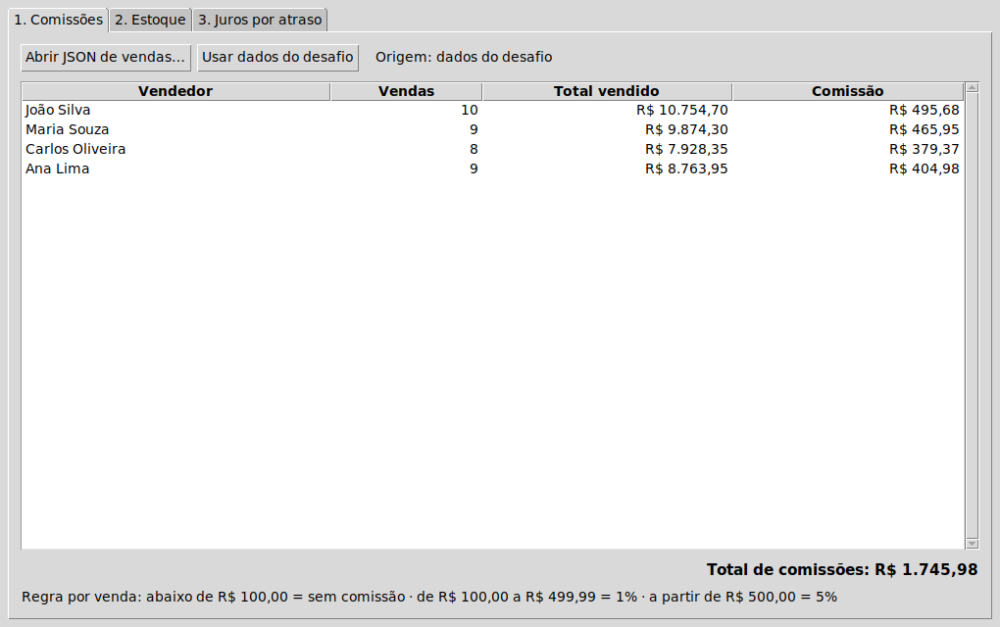
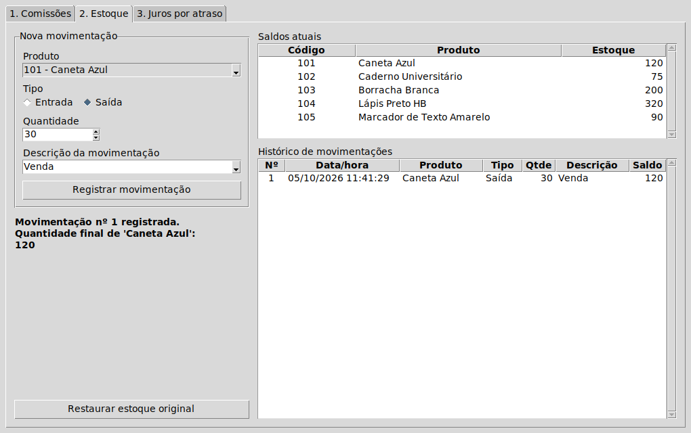
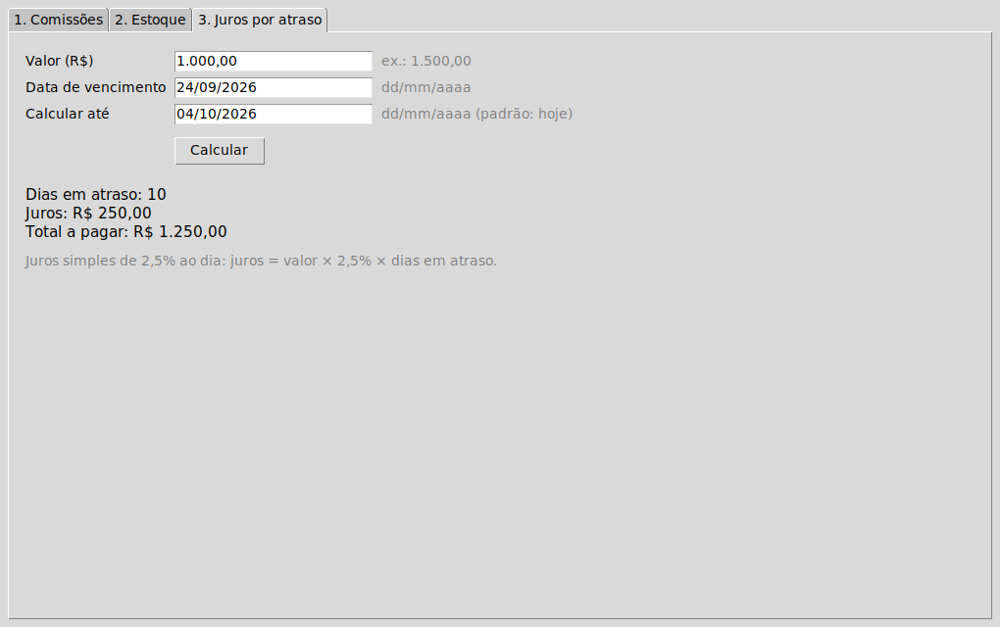

# Desafio técnico — Desenvolvedor(a) de Sistemas Jr.

Resolvi os três exercícios em Python 3.10+: cálculo de comissão por vendedor, movimentação de estoque e juros por atraso. O projeto pode ser executado pelo terminal ou por uma interface gráfica em `tkinter`. Os dados de exemplo estão em `src/desafio/dados/`.

## Executar

```bash
git clone https://github.com/yuriOleal/desafio-tecnico.git
cd desafio-tecnico
python -m venv .venv
```

Ative o ambiente virtual: `.venv\Scripts\activate` no Windows (Prompt de Comando) ou `source .venv/bin/activate` no Linux/macOS. Depois:

```bash
pip install .
desafio comissoes
desafio estoque listar
desafio juros 1000 24/09/2026 --hoje 04/10/2026
desafio gui
```

No Linux, a interface gráfica também exige que `tkinter` esteja instalado no sistema. Para experimentar sem instalar o pacote, use `PYTHONPATH=src python -m desafio comissoes` no Linux/macOS ou `set PYTHONPATH=src && python -m desafio comissoes` no Prompt de Comando do Windows.

## Exercícios

| Exercício | O que foi implementado | Exemplo |
|---|---|---|
| Comissões | Lê o JSON, calcula a comissão de cada venda e agrupa por vendedor | `desafio comissoes` |
| Estoque | Registra entradas e saídas com ID, descrição, histórico e saldo final | `desafio estoque saida -p 101 -q 30 -d Venda` |
| Juros | Calcula 2,5% ao dia de atraso sobre o valor original | `desafio juros 1000 24/09/2026 --hoje 04/10/2026` |

Em `comissoes`, use `-a caminho/arquivo.json` para outro arquivo ou `--json` para obter a saída em JSON. Em `estoque`, execute sem ação para abrir o menu, ou use `listar`, `entrada`, `saida`, `historico` e `resetar`. Execute `desafio --help` para ver as opções.

| Comissões | Estoque | Juros |
|:---------:|:-------:|:-----:|
|  |  |  |

## Premissas que adotei

- A comissão é calculada **por venda**: abaixo de R$ 100,00 = 0%; de R$ 100,00 até antes de R$ 500,00 = 1%; a partir de R$ 500,00 = 5%. Somo os valores e arredondo a comissão final de cada vendedor para centavos.
- Estoque não pode ficar negativo. Os IDs são sequenciais, e os saldos e o histórico ficam em um arquivo JSON criado no primeiro uso. O comando `resetar` volta aos dados iniciais e apaga o histórico.
- Interpretei a taxa de 2,5% ao dia como **juros simples** sobre o valor original. Um vencimento hoje ou no futuro não gera juros.
- Usei `Decimal` nos cálculos monetários para evitar erro de ponto flutuante.

Por padrão, o estoque fica em `%APPDATA%\desafio-tecnico` no Windows e em `~/.local/share/desafio-tecnico` no Linux. Para usar outra pasta, passe `--dados-dir PASTA` antes da ação (por exemplo, `desafio estoque --dados-dir ./dados listar`) ou defina `DESAFIO_DADOS_DIR`.

## Testes e executáveis

```bash
pip install -e ".[dev]"
pytest
ruff check .
ruff format --check .
```

O CI executa os testes e o lint no Windows e no Linux. Há também um fluxo de build para Windows e Linux a partir de uma tag `v*`; os arquivos ficam na página de [Releases](https://github.com/yuriOleal/desafio-tecnico/releases). Para gerar no seu sistema:

```bash
pip install -e ".[build]"
python scripts/build.py
```

O PyInstaller gera executáveis somente para o sistema no qual o build é executado. Os binários gerados não têm assinatura digital.

Licença MIT — [LICENSE](LICENSE).
